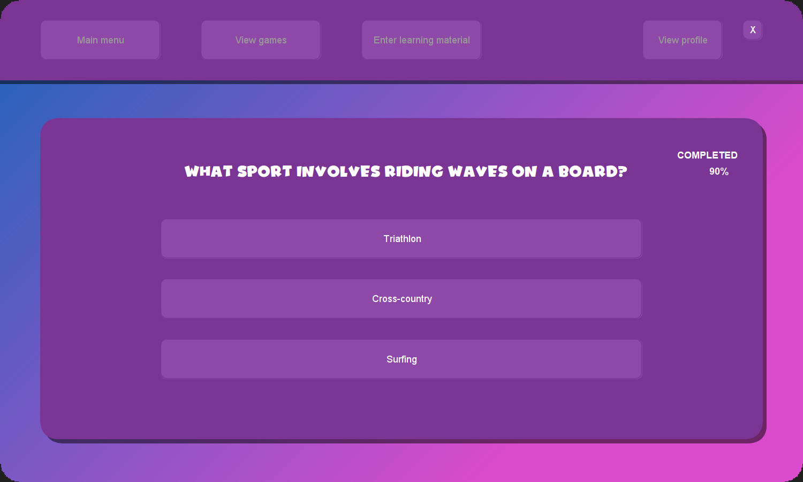
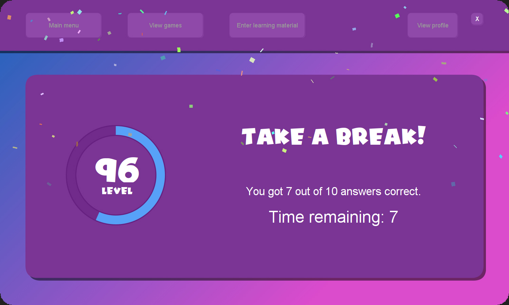

# Quiz Whiz

*Quiz Whiz* is an engaging kids' game designed to promote digital wellbeing by allowing users to create their own topics, questions, and answers, and then play these questions in a fun flashcard format. This project was developed as part of a group software development assignment at QUT, consisting of a team of five individuals. My primary contributions focused on the frontend and game development aspects.

## Access the Game

You can download and run the game from the provided link. To access existing data, log in with the username 'James' and password 'James', or create a new account to start your own custom quizzes.

## Screenshots

## Features

- **Custom Quizzes**: Create your own topics, questions, and answers.
- **Flash Card Format**: Engage in a fun and interactive way to learn.
- **Rewards System**: Unlock new themes and track progress with visual rewards.
- **User-Friendly Interface**: Enjoy an intuitive and engaging user interface.

## Installation and Setup

**Setup Guide**: A zip containing Quiz Whiz as a packaged .exe application is included.

1. **Download the zip file** from the releases section.
2. **Extract the contents** of the zip file to a desired location on your computer.
3. **Run the executable file** (`QuizWhiz.exe`) to start the game.
4. **Login** with the username 'James' and password 'James', or create a new account to start your own custom quizzes.

## Usage Instructions

To play the game using the existing logon, simply log in and go to view games, choose Flash Cards, and a topic. If creating your own login, you will need to create a topic with a minimum of 3 questions and answers to proceed.

## Contributions

- **Initial Application Design**: Developed the initial design concept for the application, ensuring a user-friendly and engaging interface.
- **Java Implementation**: Implemented the application design using Java, focusing on creating a seamless user experience.
- **Project Framework**: Developed a framework for the project to run on, facilitating efficient collaboration among team members.
- **Flash Card Game Development**: Designed and developed the flash card game, allowing users to play custom quizzes.
- **Game Completion Screen**: Created the game completion screen, including a confetti visual effect to celebrate users' achievements.
- **Rewards Progress Ring**: Developed a rewards progress ring feature to visually track users' progress and encourage continued play.
- **Unlockable Theme Rewards**: Created unlockable theme rewards to enhance user engagement and provide a sense of accomplishment.
- **UI Design Polishing**: Polished the overall UI design, including selecting fonts, adding titles, and ensuring a cohesive visual aesthetic.
- **Team Assistance**: Provided assistance to other team members throughout the project, ensuring smooth progress and addressing any challenges.

Note: The files included in this GitHub repository are only those I personally worked on, highlighting my contributions to the project.

## Technologies Used

- **Java**
- **Figma**: Used for initial design mockups and prototyping.
- **Photoshop**: Utilized for creating and refining visual assets.
- **Stable Diffusion**: Employed for generating the Quiz Whiz main menu image.

## Project Management

- **Agile Methodology**: Employed Agile practices, specifically using sprints to ensure iterative progress and regular feedback.
- **Collaboration Tools**: Used GitHub for version control and collaborative development, ensuring efficient code management and team collaboration.

## Credits
I extend my gratitude to the Code Crusaders team for their exemplary efforts and dedication, which ensured the timely and successful completion of this project, surpassing all expectations.